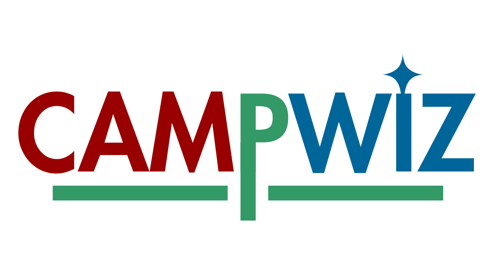

## CampWiz 
This is a tool to help you to review media uploaded to Wikimedia Commons. This tool is designed to help you to evaluate any photography contest organized each year wikimedia commons. The tool is the visioned by Tiven Gonsalves, the lead coordinator of Wiki Loves Folklore. The tool is hosted on [https://campwiz.toolforge.org/](https://campwiz.toolforge.org/).
### Basic functionality
This tool let you
- Create a campaign.
- Create rounds for each campaign.
- Create evaluation criteria for the rounds.
- Assign Jury for the rounds (In case of public rounds, anyone with an active account can evaluate).
- Import Images/AUDIO/VIDEO from Wikimedia Commons for evaluation.
- Evaluate the Images/AUDIO/VIDEO based on the criteria.
- Export the evaluation result into csv/Excel format.
- View the evaluation result.
### What CampWiz does not do
As of now, CampWiz does not provide the following features:
- any way to directly upload the images to Wikimedia Commons.
- hosting **article** writing competition. But for that, you can use [CampWiz v1.0](https://tools.wikilovesfolklore.org/campwiz/).
## Prerequisites
To access the tool, you need to have a device with an internet connection and a web browser. The tool is optimised to work on all devices, including mobile phones, tablets, and desktop computers. Also, you need to have an active Wikimedia account to access the tool. Apart from these, you should not need any other prerequisites to access the tool. Please go to the tool located at [https://campwiz.wikilovesfolklore.org/](https://campwiz.wikilovesfolklore.org/).
## FRAMEWORK
1. Project : Project are project names like Projects like Wiki Loves Folklore/Wiki Loves X etc
2. Campaign : Campaigns are yearly editions of the project like Wiki Loves Folklore 2025, Wiki Loves X 2025 etc
3. Rounds : Rounds are jury rounds on a specific campaign.
### Roles
1. **Admin**
    - Admin are system administrators who can create new Projects like Wiki Loves Folklore/Wiki Loves X and can assign Lead to the specific project. These leads can be leaders/founders/coordinators of a wiki campaign.
2. **Lead**
    - Lead are users who can create campaigns like `Wiki Loves Folklore 2024, Wiki Loves X in Igbo community, Wiki Loves M in Switzerland` etc. They are the leaders of the campaign and can assign coordinators who can assist them in their tasks. Note: - A lead cannot be lead in two projects.
3. **Coordinator**
    - Coordinators are the users who help to create rounds and help the lead in the works related to jury of wiki campaigns. They can be assigned by the Lead.
4. **Jury**
    - Jury are the set of experienced users/Volunteers who have access to the judging interface of the tool. These users help in selection of the Winning media of the campaign.
## How to use CampWiz NXT
The most of you would be using the tool is to evaluate the images/audios/videos uploaded to Wikimedia Commons as a `Jury`. But, there are other roles as well which carry out the base for jury tasks.
### As a Jury
This section will guide you on how to evaluate the images/audios/videos uploaded to Wikimedia Commons as a `Jury` of a round.
#### Evaluate the submissions (Images/Audio/Video)
1.  Go to the tool located at [https://campwiz.wikilovesfolklore.org/](https://campwiz.wikilovesfolklore.org/).
2.  Click on the `Login` button. You will be redirected to the Wikimedia OAuth page. 
3.  After logging in, you should click on `Authorize` to give the tool the necessary permissions. (The tool will only have access to your username and the date you created the wikipedia account. For more information, please read the [Privacy Policy](https://campwiz.wikilovesfolklore.org//policy/privacy)).
4.  After clicking on `Authorize`, you will be redirected back to the tool. You should see the list of the ongoing campaigns. Click on the `Go to Campaign` button to start evaluation.
5.  You will be brought to thecampaign page. You should see all the rounds, campaign information, and a button called `Evaluation Area`. Click on the `Evaluation Area` button to start evaluating the images.

6.  You will be brought to the evaluation area. Depending on the round configuration set by coordinators, you might see three different interfaces. 
    -   **Yes/No Interface**: You will se a single submission (image/audio/video) at a time. You should see four buttons, `Previous`, `Yes`, `No` and `Skip`. Click on the button that you think is appropriate. They are in the form of special button denoting ⏮️ ❌ 🇴 ⏭️
    - **Rating Interface**: You will see a single submission (image/audio/video) at a time. You should see total five hearts. Click on the number of stars you think is appropriate. They are in the form of special button denoting ⏮️ ❤️❤️❤️❤️❤️ ⏭️
    - **Ranking Interface**: You will see approximately 20 images at a time. Each image will have a position at the top left corner. You should drag and drop the images to the appropriate position.
7.  After evaluating all the images, you should see a screen saying `No pending submissions`. You can now return to the campaign page by clicking on the `Go to Round` button.
   

8. You canalways come back to the evaluation area by clicking on the `Evaluation Area` button (if the round is still active).
    
### As a Lead/Coordinator
This section will guide you on how to create a campaign as well as create rounds on a campaign.
#### Creation of campaign and rounds by Lead/Coordinator.
1. A Lead can create a campaign using the dashboard section on the Homepage at [https://campwiz.wikilovesfolklore.org/](https://campwiz.wikilovesfolklore.org/)
2. Use the `Create Campaign` button and create campaign by inputting information like 
    - Name of the campaign 
    - Date range of the campaign - All images during this date frame will only be taken into the tool. 
    - Short Description of the campaign.
    - Rules of the campiagn/ Wikimedia Commons Link.
    - Adding of Coordinators.
3. Lead/Coordinator can edit the campaign details.
4. Lead/Coordinaors can create a round in the specific campaign. The same can be done by clicking `Create Round` button on the campaign page.
5. A new popup with details to be included as below.
    - Name of the round - A custom name like `prejury round` / `Round 1` etc can be filled in the name.
    - Voting deadline - A deadline for the campaign.
    - Jury directions - A set of directions for the jury.
    - Jurors - Wikimedia Usernames of the Jury members
    - Quorum - A slider to denote that one image to be evaluated by a number of jurors. Quorum cannot exceed number of jury.
    - Additional restrictions - These are some ways you can have control over what photos get imported in your round.
    - User to click on `Create round` button.
6. Lead/Coordinator get a popup of adding media from wikimedia category option. Multiple categories can also be imported in the round.
7. Lead/Coordinator need to wait untill all the media is imported in the tool and then click `Start Round`
8. The Lead/Coordinator can pause and redestribute the evaluations in case of jury default.
9. Lead/Coordinator can mark round as complete by clicking `Mark as Complete` button after all jury complete the evaluation.
10. Same process to be followed for creating multiple round.

### As an Admin
This section will guide you on how to create a Project 
#### Creation of Project by Tool Admin.
1. An Admin can create a Project by using the dashboard section on the Homepage at [https://campwiz.wikilovesfolklore.org/](https://campwiz.wikilovesfolklore.org/)
2. Admin can click on the `Create Project` on the dashboard.
3. create Project by inputting information like 
    - Name of the Project
    - Modify the project code if required.
    - Website/Wikipage of the project.
    - Add Project Leads
    - Add logo of the Project.
    - Click Create Project button.
4. Admins can modify the projects using the same steps.

## Credits
Team Member
- [Nokib Sarkar](https://github.com/nokibsarkar) (Lead Developer)
- [Tiven Gonsalves](https://github.com/Tiven2240)
    - Co-ordinator
    - the person with the vision
    - the person who designed the logo
- [Mst. Rukaiya Islam Tonni](https://github.com/Tonni28) (Frontend)

## License
If not otherwise mentioned, this tool is licensed under the GPL-3.0 license. You can find the full text of the license in the [LICENSE](./LICENSE.md) file.

***The code located inside [`extensions`](./extensions/) is not part of this codebase and therefore, it is not covered by this license. The code inside the `extensions` folder is covered by seperate license mentioned there.***
## Timeline
- [x] 2025-03-22: Initial version of the tool is ready.
- [x] 2025-03-25: The tool will be ready for testing.
- [x] 2025-04-01: Open for beta testing to the public.
- [x] 2025-04-15: In production
- [x] 2025-06-01: Make the Code Open Source under a suitable license.
- [ ] 2025-05-17: Migrate the Code to Toolforge ([T394515](https://phabricator.wikimedia.org/T394515))

## History & Vision
"This tool was created as part of the ongoing efforts of Nokib Sarkar, the lead developer behind the Wiki Loves Folklore project—one of the most prominent photography campaigns within the Wikimedia Movement. During past editions of the competition, it became evident to the organizing team and jury that existing tools lacked a community-centric approach and failed to fully empower volunteers in the image selection process on Wikimedia Commons.

Driven by this need, the development of this tool began—guided by feedback from Wikimedia Commons volunteers, jury members, and years of experience from organizing Wiki Loves Folklore. The inspiration for this project was significantly shaped by the success of the previous Feminism and Folklore article jury tool, known as Campwiz, which received the Coolest Tool Award at Wikimania Poland.

Powered by Wikimedia Switzerland, the vision to build a jury tool designed for the community, by the community took shape. Initial development was supported by the servers of Wiki Loves Folklore, a community initiative endorsed by the Wikimedia Foundation. The project gained further momentum during Wikimania, where the development roadmap and vision were collaboratively sketched by community members.

After months of dedicated research, coding, and testing, the tool is now live—debuting with the jury process for the seventh edition of Wiki Loves Folklore. This marks a proud milestone, as we host our very first campaign using infrastructure built specifically for Wikimedia campaigns.

Built with Golang—a language the developer learned specifically for this project—this tool represents a labor of love, technical curiosity, and deep commitment to the Wikimedia community. We look forward to migrating it to Wikimedia Cloud servers soon, ensuring greater accessibility and sustainability.

We extend our heartfelt thanks to:
- **Wikimedia Switzerland** and the **Wikimedia Foundation** for their generous support,
- **Wiki Loves Folklore** for the initial support hosting the tool and resources to experiment the software engineering needs
> ***Personal Note From the Developer:*** Wiki Loves Folklore always supported all kind of technical advancement toward the community including amazing tools like FnF List Generator, CampWiz, CampWiz nxt (this tool). They were always open to experimentation and technical vision. Sometimes, mistakes by me happened, which incurred some resources being wasted or under-utilized. But they gave me the freedom to work on the research and development without any back-pulling. I am very very grateful to them.
>   &mdash; Nokib Sarkar, Lead Developer

- Our fellow volunteers for their help in translation, documentation, testing,
- And the jury members who placed their trust in this tool.

#WeTogether, have built something that empowers the community and strengthens our collective mission. This is just the beginning."

History & Vision Authored by [Tiven Gonsalves](https://github.com/Tiven2240) Lead Coordinator. Wiki Loves Folklore.

## Some happy memories
- [Wikimedia CH having an interview about CampWiz being the one of the coolest tool award 2024](https://wikimedia.ch/en/news/surprise-at-the-wikimania-why-wikimedia-ch-had-a-special-reason-to-be-happy/)
- [The you tube video showing CampWiz being one of the coolest tool award](https://www.youtube.com/watch?v=F-Z2ODmUySY)
