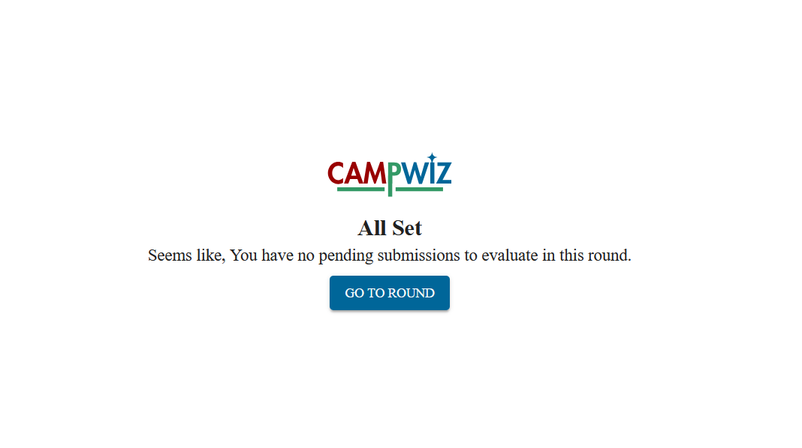

## CampWiz 
This is a tool to help you to upload images to Wikimedia Commons. This tool is designed to help you to evaluate many photography contest organized each year wikimedia commons. The tool is the visioned by Tiven Gonsalves, the lead of Wiki Loves Folklore.
### Basic functionality
This tool let you
- Create a campaign
- Create rounds for the campaign
- Create evaluation criteria for the rounds
- Assign Jury for the rounds (In case of public rounds, anyone can evaluate)
- Import images/AUDIO/VIDEO from Wikimedia Commons for evaluation
- Evaluate the images/AUDIO/VIDEO based on the criteria
- Export the evaluation result
- View the evaluation result
### What CampWiz does not do
As of now, CampWiz does not provide the following features:
- any way to directly upload the images to Wikimedia Commons.
- hosting **article** writing competition. But for that, you can use [CampWiz v1.0](https://tools.wikilovesfolklore.org/campwiz/).
## Prerequisites
To access the tool, you need to have a device with an internet connection and a web browser. The tool is designed to work on all devices, including mobile phones, tablets, and desktop computers. Also, you need to have a Wikimedia account to access the tool. Apart from these, you should not need any other prerequisites to access the tool. Please go to the tool located at [https://campwiz.wikilovesfolklore.org/](https://campwiz.wikilovesfolklore.org/).
## How to use CampWiz
The most of you would be using the tool is to evaluate the images/audios/videos uploaded to Wikimedia Commons as a `Jury`. But, there are other roles as well. We will discuss them later.
### As a Jury
This section will guide you on how to evaluate the images/audios/videos uploaded to Wikimedia Commons as a `Jury` of a round.
#### Evaluate the submissions (Images/Audio/Video)
1.  Go to the tool located at [https://campwiz.wikilovesfolklore.org/](https://campwiz.wikilovesfolklore.org/).
2.  Click on the `Login` button. You will be redirected to the Wikimedia OAuth page. 
3.  After logging in, you should click on `Authorize` to give the tool the necessary permissions. (The tool will only have access to your username and the date you created the wikipedia account. For more information, please read the [Privacy Policy](https://campwiz.wikilovesfolklore.org//policy/privacy)).
4.  After clicking on `Authorize`, you will be redirected back to the tool. You should see the list of the ongoing campaigns. Click on the `Go to Campaign` button to start evaluation.
5.  You will be brought to thecampaign page. You should see all the rounds, campaign information, and a button called `Evaluation Area`. Click on the `Evaluation Area` button to start evaluating the images.

6.  You will be brought to the evaluation area. Depending on the round configuration, you might see three different interfaces. 
    -   **Yes/No Interface**: You will se a single submission (image/audio/video) at a time. You should see two buttons, `Yes` and `No`. Click on the button that you think is appropriate.
    - **Rating Interface**: You will see a single submission (image/audio/video) at a time. You should see total five stars. Click on the number of stars you think is appropriate.
    - **Ranking Interface**: You will see approximately 20 images at a time. Each image will have a position at the top left corner. You should drag and drop the images to the appropriate position.
7.  After evaluating all the images, you should see a screen saying `No pending submissions`. You can now return to the campaign page by clicking on the `Go to Round` button.

8. You canalways come back to the evaluation area by clicking on the `Evaluation Area` button (if the round is still active).

### Evaluate a Public Round
1.  Step 1
    1.  Sub-step a
    2.  Sub-step b
    3.  Sub-step c
2.  Step 2
3.  Step 3

*When a user has completed all the steps you list, they should have
successfully done the thing you named in the section header.*
### {Do another thing}

1.  Step 1
2.  Step 2
    1.  Sub-step a
    2.  Sub-step b
    3.  Sub-step c
3.  Step 3

*When a user has completed all the steps you list, they should have
successfully done the thing you named in the section header.*

## Troubleshooting

{One thing that can go wrong}

-   How to resolve it

{Another thing that can go wrong}

-   How to resolve it

## How to get help and report issues

-   Report issues at {your issue tracker or process}.
-   Ask questions or get help at {where to contact you}. You can expect
    a response in {time period}.
## Developer documentation

### Technical implementation

*Provide a brief technical overview of how you implemented the tool's
main functionality.*

This tool uses {some library, API, platform, other technology} to do
{some technical operation}. It depends on {some library, API, platform,
other technology} because it uses {some technology} for {some technical
operation}.

### Code structure

The {_______} module does {_______}. The {_______} directory contains
{_______}.

*A high-level description of the code architecture, focusing on what a
developer would need to understand if they were trying to get oriented
to the repository so they can contribute code or debug an issue.*

### Local development

#### Set up

How to set up development environment:

1.  {Write the step here.}
    1.  {Substep 1}
    2.  {Substep 2}

#### Install

How to install:

1.  {Write the step here.}
    1.  {Substep 1}
    2.  {Substep 2}

{Optional: Include a code sample or screenshot that helps your users
complete this step}

#### Configure

How to configure:

1.  {Substep 1}
2.  {Substep 2}

#### Build and test

How to build and run locally:

1.  {Write the step here.}
    1.  {Substep 1}
    2.  {Substep 2}

How to run tests:

1.  {Write the step here.}
    1.  {Substep 1}
    2.  {Substep 2}

#### Debugging

-   {specific error message or log/console output}
    -   How to resolve the error, or what the log output means

<!--code example -->

-   {specific error message or log/console output}
    -   How to resolve the error, or what the log output means

## How to contribute

The CampWiz maintainers welcome contributions! (OR)...are not able
to accept contributions at this time.

-   {Type of contribution you want}
-   {Another type of contribution you want}

### Contribution process

Before contributing, read the {Code of Conduct} that outlines community
guidelines and expectations. We follow {style guide / coding
conventions}.

1.  {Write the step here.}
    1.  {Substep 1}
    2.  {Substep 2}

<!-- code example -->

1.  {Write the step here.}
    1.  {Substep 1}
    2.  {Substep 2}

## Credits
Copyright &copy; 2025 by
- [Nokib Sarkar](https://github.com/nokibsarkar) (Lead Developer)
- Tiven Gonsalves (Co-ordinator and the person with the vision)
- [Mst. Rukaiya Islam Tonni](https://github.com/Tonni28) (Frontend)

## License
If not otherwise mentioned, this tool is licensed under the GPL-3.0 license. You can find the full text of the license in the [LICENSE](./LICENSE.md) file.

***The code located inside [`extensions`](./extensions/) is not part of this codebase and therefore, it is not covered by this license. The code inside the `extensions` folder is covered by seperate license mentioned there.***
## Timeine
- [x] 2025-03-22: Initial version of the tool is ready.
- [ ] 2025-03-25: The tool will be ready for testing.
- [ ] 2025-04-01: Open for beta testing to the public
- [ ] 2025-05-01: Make the Code Open Source under a suitable license.
## Some happy memories
- [Wikimedia CH having an interview about CampWiz being the one of the coolest tool award 2024](https://wikimedia.ch/en/news/surprise-at-the-wikimania-why-wikimedia-ch-had-a-special-reason-to-be-happy/)
- [The you tube video showing CampWiz being one of the coolest tool award](https://www.youtube.com/watch?v=F-Z2ODmUySY)
